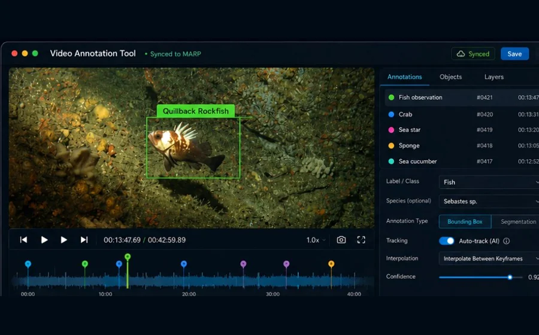
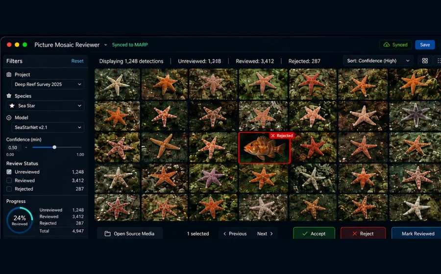
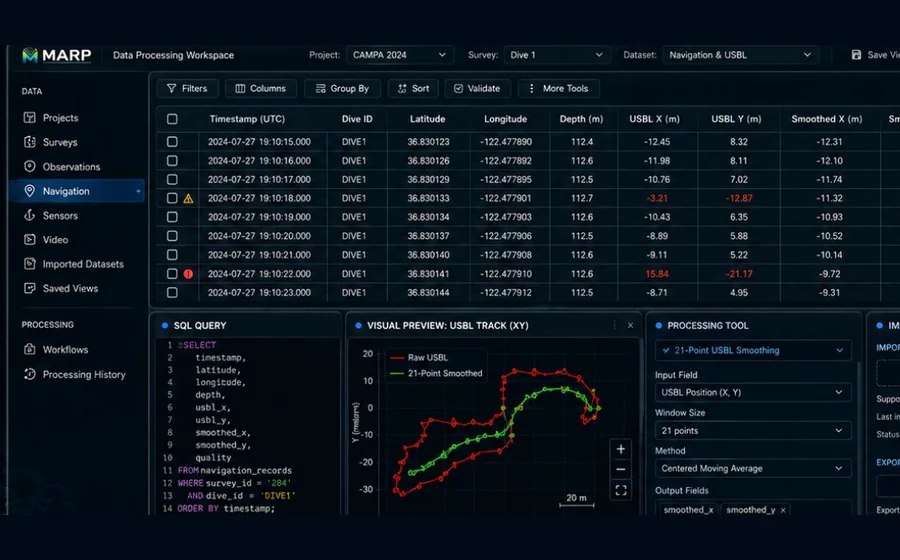
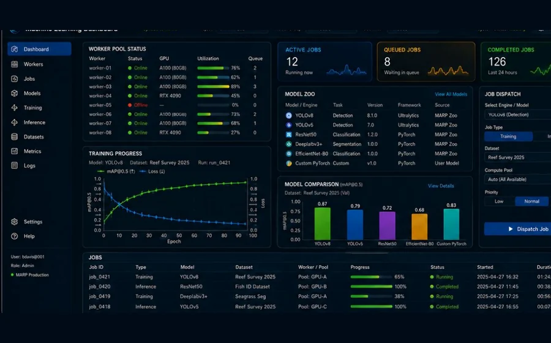
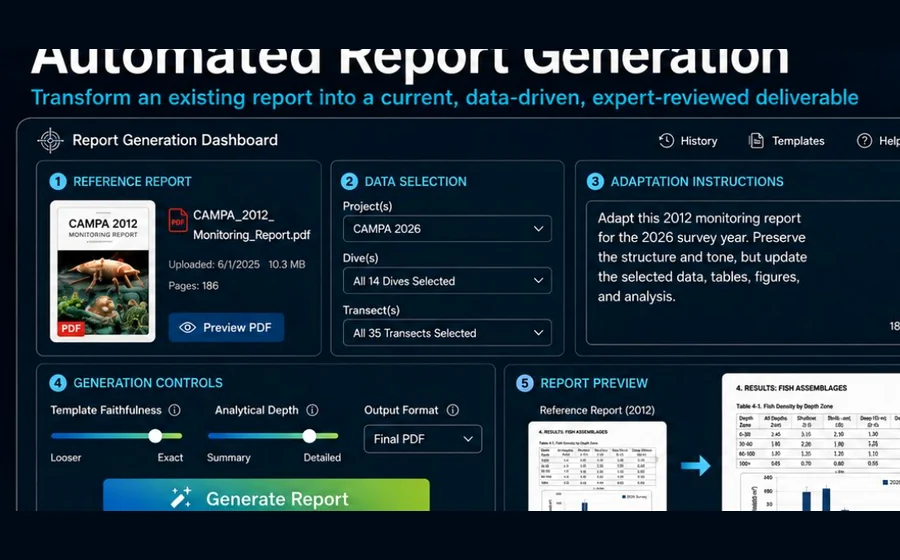

# Marine Analysis and Reporting Platform

<p align="center">
  <strong>MARP</strong> is a self-hosted platform for ecological data, expert interpretation, video workflows, machine-learning assistance, processing pipelines, and reporting.
</p>

<p align="center">
  
  
  
  
  
  
</p>


<div  bgcolor="#03101f">
<table width="100%">
  <tr>
    <td align="center" bgcolor="#03101f">
      <br>
      
      <br><br>
    </td>
  </tr>
</table>
</div>

> **From observation to understanding.**  
> MARP connects ecological observations, expert judgment, video, data processing, machine learning, and reporting through one shared platform.

MARP is currently an internal production platform under active development. The long-term goal is a system-wide API and application ecosystem that organizations can host for their own ecological data workflows.

---

## Open source

MARP source code and documentation are released under the [Apache License 2.0](LICENSE).

- Individuals and organizations may use, study, modify, host, fork, and redistribute MARP subject to the license.
- Commercial, nonprofit, academic, government, and personal use are all permitted.
- Contributions are encouraged but are not required.
- The open-source model is intended to support high adoption and long-term technical continuity.
- Organizations are expected to host and configure their own deployments.

Related documents:

- [Apache License 2.0](LICENSE)
- [Contributing to MARP](CONTRIBUTING.md)
- [Project governance](GOVERNANCE.md)

### License scope

The Apache License 2.0 applies to:

- MARP source code
- MARP project documentation

The following are **not** automatically licensed under Apache 2.0:

- MARP logos
- official MARP branding
- ecological datasets
- survey data
- video and imagery
- model weights
- third-party assets
- partner-owned content
- confidential or restricted materials

Unless explicitly stated otherwise, these materials remain subject to their own ownership, permissions, or license terms.

### Branding

The MARP logo and official branding are excluded from the Apache 2.0 software license. Use of official MARP branding requires written permission. Truthful descriptive statements such as "Built with MARP" or "Based on MARP" are permitted when they do not imply endorsement, certification, or official status. Independent forks must not present themselves as official MARP releases without authorization.

---

## Contents

- [Open source](#open-source)
- [Why MARP](#why-marp)
- [Platform workflow](#platform-workflow)
- [What this repository contains](#what-this-repository-contains)
- [Architecture](#architecture)
- [Frontend applications](#frontend-applications)
- [Routes](#routes)
- [Getting started](#getting-started)
- [Configuration](#configuration)
- [Database migrations and seeds](#database-migrations-and-seeds)
- [Documentation](#documentation)
- [Hosting](#hosting)
- [Contributing](#contributing)
- [Current constraints](#current-constraints)
- [Roadmap](#roadmap)
- [SQL and maintenance notes](#sql-and-maintenance-notes)
- [License](#license)

---

## Why MARP

Ecological analysis is not one task. It is a connected workflow involving field collection, video review, expert interpretation, data cleaning, machine-learning support, reporting, and long-term stewardship.

MARP brings those activities together behind a shared API, common data model, and reusable service layer.

The platform is designed around a simple principle:

> **Biologists lead. MARP amplifies.**

Machine learning and automation reduce repetitive work, but biological interpretation, validation, and scientific judgment remain with experts.

### Platform workflow

| Collect | Review | Process | Assist | Deliver |
|:--|:--|:--|:--|:--|
| Ecological observations, ROV surveys, sensors, imagery, and video | Expert interpretation, annotation, and validation | Cleaning, transformation, measurement, and analysis | Machine-learning inference, tracking, classification, and training | Reports, maps, visualizations, exports, and partner-ready data products |

### Core platform capabilities

- **Ecological data** — projects, surveys, sessions, observations, species, and associated records
- **Video and imagery** — source media, exact frames, keyframes, evidence, and review workflows
- **Expert review** — biologist-led interpretation and quality assurance
- **Data processing** — validation, transformation, spatial processing, and reproducible workflows
- **Machine learning** — dataset generation, inference, training, model management, and distributed workers
- **Reporting** — verified outputs, automated report generation, visualizations, and exports

---

## What this repository contains

This repository combines the MARP API and the static frontend applications currently served by the same Node.js process.

- Express API for MARP data, sessions, observations, users, projects, species, keyframes, tasks, and machine-learning dataset workflows
- Static frontend applications served by the Node server
- OpenAPI generation and Swagger UI for API consumers
- Developer documentation generated with JSDoc
- Sequelize models, migrations, and seeders for PostgreSQL
- Reporting routes, report views, and data-product support
- Shared frontend assets, partials, and application-specific interfaces

---

## Architecture

MARP uses a layered backend with static frontend applications served by Express.

```text
Browser / MARP application
            │
            ▼
       Express server
            │
   ┌────────┼─────────┐
   │        │         │
Frontend   API    Documentation
 routes   routes       routes
            │
            ▼
      Controllers
            │
            ▼
   Services / domain logic
            │
            ▼
       Repositories
            │
            ▼
   Sequelize models
            │
            ▼
       PostgreSQL
```

### Runtime layers

1. **HTTP server** — `server.js` initializes Express, middleware, static serving, API routes, and documentation routes.
2. **Controllers** — request handling and endpoint orchestration.
3. **Services and repositories** — business logic and data-access boundaries.
4. **Models** — Sequelize model registry and associations.
5. **PostgreSQL** — primary persistence layer.
6. **Frontend applications** — static applications served directly by Express.

### Primary directories

| Directory | Purpose |
|:--|:--|
| `controller` | HTTP-level API handlers |
| `service` | Business and domain orchestration |
| `repository` | Data access |
| `model` | Sequelize models and database wiring |
| `migrations` | Versioned schema changes |
| `seeders` | Baseline and sample data |
| `reporting` | Report-specific API routes |
| `frontend` | Static MARP applications and shared assets |
| `docs` | Generated OpenAPI and developer documentation |

---

## Frontend applications

The frontend is organized as static applications with shared assets.

```text
frontend/
├── apps/
│   ├── entry/
│   └── dashboard/
└── shared/
    ├── partials/
    └── assets/
```

### Entry application

`frontend/apps/entry`

The public-facing MARP entry experience communicates the platform narrative:

- One shared platform backed by a common API and data model
- Workflow stages: Collect, Review, Process, Assist, Deliver
- Capability areas: ecological data, video and imagery, expert review, processing, machine learning, and reporting
- Responsive navigation and landing-page sections
- Accessible prototype login dialog
- Animated interface accents and section transitions

The current login interface is an interaction prototype. It does not perform production authentication.

### Dashboard application

`frontend/apps/dashboard`

The dashboard currently includes:

- Overview page with KPI cards, charts, maps, filters, and recent-transect tables
- User activity report at `/apps/dashboard/user-activity.html`
- User hours report at `/apps/dashboard/user-hours.html`
- Demo-oriented visualization scaffolding alongside production-like API calls

### Shared frontend shell

`frontend/shared`

Shared resources include:

- Header and footer partials
- Shared CSS and JavaScript
- Partial injection through `frontend/shared/assets/js/partials.js`
- Shared image and icon assets

---

## Application concepts

These interfaces show the major application categories MARP is intended to support.

<p align="center">
  
  
  
  
  
</p>

| Application | Purpose |
|:--|:--|
| **Video Annotation Tool** | Frame-accurate ecological annotation with expert and machine-learning-assisted review |
| **Picture Mosaic Reviewer** | Rapid high-volume review of detections and imagery |
| **Data Processing Workspace** | Cleaning, validation, transformation, visualization, and reproducible processing |
| **Machine Learning Dashboard** | Models, jobs, inference, training, workers, metrics, and operational visibility |
| **Automated Report Generation** | Expert-reviewed reports and data products assembled from verified MARP data |

---

## Routes

### Frontend routes

| Route | Purpose |
|:--|:--|
| `/` | Serves `frontend/apps/entry/index.html` |
| `/apps/:appName` | Serves `frontend/apps/:appName/index.html` when present |
| `/apps/*` | Static assets under `frontend/apps` |
| `/shared/*` | Shared assets and partials |
| `/assets/*` | Compatibility alias to `frontend/shared/assets` |

### Compatibility redirects

| Legacy route | Current route |
|:--|:--|
| `/dashboard1.html` | `/apps/dashboard/` |
| `/userActivity.html` | `/apps/dashboard/user-activity.html` |
| `/userHours.html` | `/apps/dashboard/user-hours.html` |

### Documentation routes

| Route | Purpose |
|:--|:--|
| `/api-docs` | Swagger UI |
| `/api/openapi.json` | Generated OpenAPI JSON |
| `/openapi.json` | Compatibility route for generated OpenAPI JSON |
| `/developer-docs` | Generated JSDoc developer documentation |

### API namespace

All backend endpoints are served under:

```text
/api/*
```

Unknown API routes should return a JSON `404`. Unknown non-API routes should return the normal application `404`.

---

## Getting started

### Prerequisites

- Node.js
- npm
- PostgreSQL
- A configured environment file

### Install dependencies

```bash
npm install
```

### Start development mode

```bash
npm run dev
```

### Start normally

```bash
npm start
```

The server uses `PORT` when provided and otherwise falls back to port `3000`.

After startup, the main local routes are typically:

```text
http://localhost:3000/
http://localhost:3000/api-docs
http://localhost:3000/developer-docs
```

---

## Configuration

Keep local credentials in `.env` and never commit that file.

A typical development configuration uses standard database variables such as:

```dotenv
NODE_ENV=development
PORT=3000

DB_HOST=localhost
DB_PORT=5432
DB_NAME=mare_development
DB_USER=mare_user
DB_PASS=replace-with-a-local-password
DB_DIALECT=postgres
```

Additional variables may be required by optional integrations or deployment environments. Confirm the exact names against the project configuration modules before deploying.

Recommended repository files:

```text
.env          Local secrets; ignored by Git
.env.example  Safe variable names and example values
```

Do not place production passwords, API keys, session secrets, or external-service credentials in the README.

---

## Database migrations and seeds

MARP uses Sequelize CLI for schema migrations and seed data.

### Run all migrations

```bash
npx sequelize-cli db:migrate
```

### Run a specific migration

```bash
npx sequelize-cli db:migrate --name 20241111192533-create-keyframes-table.js
```

### Undo all migrations

```bash
npx sequelize-cli db:migrate:undo:all
```

### Undo one migration

```bash
npx sequelize-cli db:migrate:undo --name 20241111192533-create-keyframes-table.js
```

### Create a migration

```bash
npx sequelize-cli migration:create --name create-keyframes-table
```

### Generate a seed file

```bash
npx sequelize-cli seed:generate --name seed_observation_pobsid
```

### Run all seeds

```bash
npx sequelize-cli db:seed:all
```

### Run one seed

```bash
npx sequelize-cli db:seed --seed 20231106192725-seed_observation_pobsid
```

### Undo the most recent seed

```bash
npx sequelize-cli db:seed:undo
```

---

## Documentation

MARP generates API documentation from source annotations and developer documentation from JSDoc.

Canonical API documentation sources:

1. Runtime Swagger UI: `/api-docs`
2. Runtime OpenAPI JSON: `/api/openapi.json`
3. Generated artifact: `docs/openapi.generated.json`

Legacy Swagger 2 artifacts have been removed from this repository to avoid contract drift.

### Build OpenAPI documentation

```bash
npm run docs:api:build
```

### Build developer documentation

```bash
npm run docs:dev:build
```

### Build all documentation

```bash
npm run docs:build
```

When changing an endpoint:

1. Keep the OpenAPI annotation consistent with actual behavior.
2. Update JSDoc where the public or developer contract changes.
3. Rebuild the documentation.
4. Verify `/api-docs`, `/api/openapi.json`, and `/developer-docs`.

### Schema field note template

For every OpenAPI schema property, include notes that make the field usable without reading backend code.

Required property metadata:

1. `description` - What the field means in domain terms.
2. `example` - A realistic sample value.
3. `nullable` - Present when `null` is allowed.
4. `format` - Present when type semantics matter (`date-time`, `float`, etc.).

Use additional constraints when known:

- `enum` for controlled values.
- `minimum` and `maximum` for numeric ranges.
- `readOnly` for response-only fields (for example IDs generated by the database).

If a field has context-dependent semantics, document that caveat directly in the field description rather than leaving it implicit.

### Error contract

MARP uses a standardized API error envelope for non-2xx responses.

```json
{
  "error": {
    "code": "RESOURCE_NOT_FOUND",
    "message": "Requested session was not found.",
    "status": 404,
    "requestId": "req_mdxv3u_4f7k2q",
    "details": [
      { "field": "session_id", "issue": "must be an integer" }
    ]
  }
}
```

See `docs/error-contract.md` for the full contract, code catalog, and migration guidance.

---

## Hosting

MARP is intended to be self-hosted by organizations that operate their own ecological data infrastructure.

A deployment requires:

- A supported Node.js runtime
- PostgreSQL
- Environment variables and credentials
- Persistent database storage
- Access to any configured media, processing, or external services

The application can be started directly with Node.js or managed by a process manager.

```bash
npm start
```

Optional PM2 example:

```bash
pm2 start server.js --name marp
```

A reverse proxy may be used when required by an organization's networking, TLS, or routing environment, but it is not a MARP application requirement.

Production deployments should also define:

- Backup and recovery procedures
- Log retention
- Database migration procedures
- Credential rotation
- Network-access controls
- Monitoring and restart behavior
- HTTPS termination where the application is exposed beyond a trusted network

---

## Contributing

MARP development should remain modular, documented, and reviewable.

See [CONTRIBUTING.md](CONTRIBUTING.md) for the complete contribution process, and [GOVERNANCE.md](GOVERNANCE.md) for project roles and technical decision-making.

### Recommended workflow

1. Create a focused branch from the appropriate development branch.
2. Keep each change limited to one feature, fix, or architectural concern.
3. Follow the existing controller, service, repository, and model boundaries.
4. Use relative `/api/...` paths from frontend code.
5. Do not introduce hard-coded hosts, credentials, or machine-specific paths.
6. Update OpenAPI and JSDoc when behavior changes.
7. Add or update migrations for schema changes.
8. Verify affected frontend routes and API endpoints.
9. Run available tests, linting, and documentation builds.
10. Open a pull request describing what changed, why it changed, how it was verified, and any migration or deployment impact.

### Code expectations

- Prefer clear, maintainable code over clever shortcuts.
- Comment architectural intent and non-obvious behavior.
- Keep request handling, business logic, and persistence concerns separated.
- Preserve API compatibility unless a versioned change is intentional.
- Do not commit `.env`, credentials, generated secrets, database exports, or private ecological data.

### Documentation expectations

A change is not complete when the code works but the public contract is inaccurate. Update the relevant documentation whenever routes, schemas, setup, or operational behavior changes.

---

## Current constraints

- The entry-page login is prototype-only and is intentionally not connected to authentication services.
- Dashboard pages currently mix production-like endpoints with demo visualization scaffolding.
- Legacy HTML pages under `html` are compatibility-era artifacts.
- The active served frontend is under `frontend/apps`.
- MARP is an internal production platform that is still being expanded into a system-wide API and application platform.
- There is not yet one public, centrally hosted MARP service; organizations are expected to host their own deployments.

---

## Roadmap

Current high-value improvements include:

1. Add a definitive `.env.example` with every required variable.
2. Add environment-specific deployment documentation without coupling the project to one server stack.
3. Promote dashboard prototypes into formally versioned frontend applications with tests.
4. Move report SQL view definitions into versioned migration scripts.
5. Expand automated testing for API contracts, data access, and frontend behavior.
6. Connect the entry-page login interface to production authentication and authorization.
7. Continue evolving MARP into a stable shared API for applications, workers, reports, and partner integrations.

---

## SQL and maintenance notes

The following material is retained as a working reference for report views, maintenance operations, and training-data queries. These notes should gradually be converted into versioned migrations, scripts, or dedicated technical documentation.

<details>
<summary><strong>Related tables and report views</strong></summary>

### Related tables

- `observations`
- `sessions`
- `projects`
- `users`
- `keyframes`

### Report and view tables

- `observations_report`: observations, sessions, projects, users
- `habitat_report`: observations, sessions, projects, users
- `MarineDebris_report`: observations, sessions, projects, users
- `Substrate60Second_report`: observations, sessions, projects, users

</details>

<details>
<summary><strong>View: observations_report</strong></summary>

```sql
SELECT
    projects.name AS "Project Name",
    users.name AS "Processor Name",
    sessions.type AS "Session Type",
    observations.observation_id,
    observations."obsID",
    sessions.session_id AS "Session Number",
    observations."taxReview",
    observations.taxserial,
    observations.comname,
    observations.count,
    observations.coarsesize,
    observations.sex,
    observations.tc,
    observations.etc,
    sessions.dive,
    sessions.line,
    sessions."lineId",
    observations.note,
    observations."updatedAt",
    observations.video_source,
    observations."videoLocation",
    observations."mediaPosition",
    observations."actualPosition"
FROM observations, projects, sessions, users
WHERE sessions.user_id = users.user_id
    AND sessions.session_id = observations.session_id
    AND sessions.project_id = projects.project_id
ORDER BY sessions.session_id, observations."obsID";
```

</details>

<details>
<summary><strong>View: habitat_report</strong></summary>

```sql
DROP VIEW habitat_report;

CREATE VIEW habitat_report AS
SELECT
    projects.name AS "Project Name",
    users.name AS "Processor Name",
    sessions.type AS "Session Type",
    observations.observation_id,
    observations."obsID",
    observations."PobsID",
    sessions.session_id AS "Session Number",
    observations.comname AS "Substrate",
    observations.coarsesize AS "PCTcover",
    observations.tc,
    observations.etc,
    sessions.dive,
    sessions.line,
    sessions."lineId",
    observations.note,
    observations."updatedAt",
    observations.video_source,
    observations."videoLocation",
    observations."mediaPosition",
    observations."actualPosition"
FROM observations, projects, sessions, users
WHERE sessions.user_id = users.user_id
    AND sessions.session_id = observations.session_id
    AND sessions.project_id = projects.project_id
    AND sessions.type::text = 'Habitat'::text
ORDER BY sessions.session_id, observations."obsID";
```

</details>

<details>
<summary><strong>View: MarineDebris_report</strong></summary>

```sql
DROP VIEW MarineDebris_report;

CREATE VIEW MarineDebris_report AS
SELECT
    projects.name AS "Project Name",
    users.name AS "Processor Name",
    sessions.type AS "Session Type",
    observations.observation_id,
    observations."obsID",
    observations."PobsID",
    sessions.session_id AS "Session Number",
    observations.tc,
    observations.etc,
    observations.frame,
    observations.comname,
    observations.taxserial,
    observations.count,
    observations."taxReview",
    observations.note
FROM observations, projects, sessions, users
WHERE sessions.user_id = users.user_id
    AND sessions.session_id = observations.session_id
    AND sessions.project_id = projects.project_id
    AND sessions.type::text = 'MarineDebris'::text
ORDER BY sessions.session_id, observations."obsID";
```

</details>

<details>
<summary><strong>View: Substrate60Second_report</strong></summary>

```sql
DROP VIEW Substrate60Second_report;

CREATE VIEW Substrate60Second_report AS
SELECT
    projects.name AS "Project Name",
    users.name AS "Processor Name",
    sessions.type AS "Session Type",
    observations.observation_id,
    observations."obsID",
    observations."PobsID",
    sessions.session_id AS "Session Number",
    observations.tc,
    observations.comname AS "Substrate",
    observations.substrate_bedrock AS "Bedrock",
    observations.substrate_megaclast AS "Megaclast",
    observations.substrate_cobble AS "Cobble",
    observations.substrate_boulder AS "Boulder",
    observations.substrate_pebble AS "Pebble",
    observations.substrate_granule AS "Granule",
    observations.substrate_sand AS "Sand",
    observations.substrate_mud AS "Mud",
    observations.substrate_coral_reef AS "Coral Reef",
    observations.substrate_coral_rubble AS "Coral Rubble",
    observations.substrate_shell_hash AS "Shell Hash",
    observations.substrate_shell_rubble AS "Shell Rubble",
    observations.substrate_algal AS "Algal",
    sessions.dive,
    sessions.line,
    sessions."lineId",
    observations.note,
    observations."updatedAt",
    observations.video_source,
    observations."videoLocation",
    observations."mediaPosition",
    observations."actualPosition"
FROM observations, projects, sessions, users
WHERE sessions.user_id = users.user_id
    AND sessions.session_id = observations.session_id
    AND sessions.project_id = projects.project_id
    AND sessions.type::text = 'Substrate60Second'::text
ORDER BY sessions.session_id, observations."obsID";
```

</details>

<details>
<summary><strong>View maintenance: observations_report</strong></summary>

```sql
DROP VIEW public.observations_report;

CREATE OR REPLACE VIEW public.observations_report AS
SELECT
    projects.name AS "Project Name",
    users.name AS "Processor Name",
    sessions.type AS "Session Type",
    observations.observation_id,
    observations."obsID",
    observations."PobsID",
    sessions.session_id AS "Session Number",
    observations."taxReview",
    observations.taxserial,
    observations.comname,
    observations.count,
    observations.coarsesize,
    observations.sex,
    observations.tc,
    observations.etc,
    sessions.dive,
    sessions.line,
    sessions."lineId",
    observations.note,
    observations."updatedAt",
    observations.video_source,
    observations."videoLocation",
    observations."mediaPosition",
    observations."actualPosition"
FROM observations, projects, sessions, users
WHERE sessions.user_id = users.user_id
    AND sessions.session_id = observations.session_id
    AND sessions.project_id = projects.project_id
ORDER BY sessions.session_id, observations."obsID";
```

</details>

<details>
<summary><strong>Query: rebuild PobsID per project order</strong></summary>

```sql
WITH ranked_observations AS (
    SELECT
        observations.observation_id,
        sessions.project_id,
        ROW_NUMBER() OVER (
            PARTITION BY sessions.project_id
            ORDER BY sessions.project_id, sessions.session_id, observations.observation_id
        ) AS row_num
    FROM observations
    JOIN sessions ON observations.session_id = sessions.session_id
    JOIN projects ON sessions.project_id = projects.project_id
)
UPDATE observations
SET "PobsID" = ranked_observations.row_num
FROM ranked_observations
WHERE observations.observation_id = ranked_observations.observation_id;
```

</details>

<details>
<summary><strong>Query: training-data species frame summary</strong></summary>

```sql
SELECT
    o."comname",
    COUNT(DISTINCT o."observation_id") AS observation_count,
    COUNT(DISTINCT o."video_source") AS video_count,
    SUM(k_end."framenum" - k_start."framenum") AS total_frames,
    AVG(k_end."framenum" - k_start."framenum") AS avg_frames_per_observation
FROM public."observations" AS o
JOIN public."keyframes" AS k_start
    ON k_start."observation_id" = o."observation_id"
    AND k_start."type" = 'start'
JOIN public."keyframes" AS k_end
    ON k_end."observation_id" = o."observation_id"
    AND k_end."type" = 'end'
WHERE o."note" = 'R'
GROUP BY o."comname"
ORDER BY total_frames DESC;
```

Sample result snapshot:

```text
comname                   | observation_count | video_count | total_frames | avg_frames_per_observation
--------------------------+-------------------+-------------+--------------+-----------------------------
White-plumed anemone      | 343               | 3           | 191831       | 73.7527873894655902
California sea cucumber   | 449               | 6           | 30283        | 56.3929236499068901
Fish-eating anemone       | 285               | 5           | 29953        | 88.8813056379821958
Red sea urchin            | 137               | 3           | 15493        | 60.7568627450980392
Red sea star              | 105               | 4           | 6985         | 63.5000000000000000
Bat star                  | 84                | 2           | 5484         | 60.9333333333333333
Short red gorgonian       | 55                | 2           | 3478         | 59.9655172413793103
Leather star              | 31                | 3           | 3211         | 78.3170731707317073
Cookie star               | 51                | 5           | 2852         | 55.9215686274509804
UI Henricia               | 32                | 5           | 2481         | 72.9705882352941176
Sand-rose anemone         | 11                | 2           | 1147         | 81.9285714285714286
Fish eating star          | 14                | 2           | 1067         | 76.2142857142857143
Red gorgonian             | 4                 | 1           | 501          | 125.2500000000000000
Bat Star                  | 4                 | 1           | 244          | 61.0000000000000000
Short spined sea star     | 1                 | 1           | 154          | 154.0000000000000000
UI sea star               | 2                 | 1           | 104          | 52.0000000000000000
Thorny sea star           | 1                 | 1           | 35           | 35.0000000000000000
```

</details>

<details>
<summary><strong>Scratch notes</strong></summary>

Previous PostgreSQL connection pattern:

```bash
psql -d mare_development -U mare_user
```

Previous `PobsID` reset sequence:

```sql
ALTER TABLE observations DROP COLUMN "PobsID";
ALTER TABLE observations ADD COLUMN "PobsID" integer;
```

</details>

---

## License

MARP source code and project documentation are licensed under the
[Apache License, Version 2.0](LICENSE).

Copyright 2026 Marine Applied Research and Exploration.

The MARP name, logo, official branding, ecological data, video, imagery,
model weights, partner materials, and third-party assets are not automatically
included under the Apache 2.0 license.

---

<p align="center">
  
</p>

<p align="center">
  <strong>Explore. Inform. Protect.</strong>
</p>
